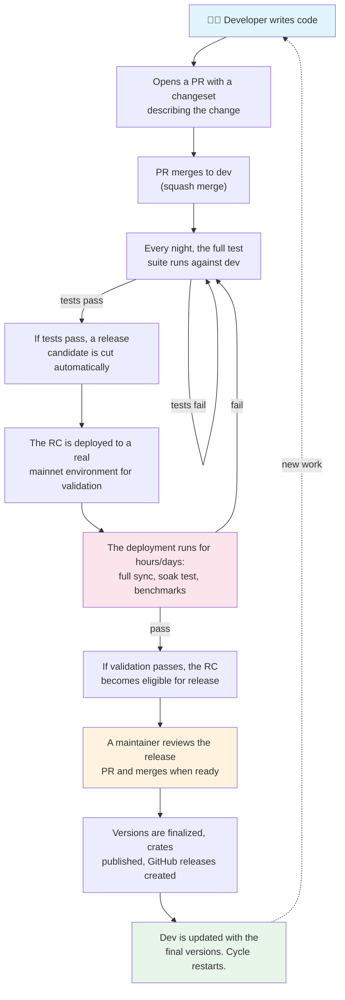
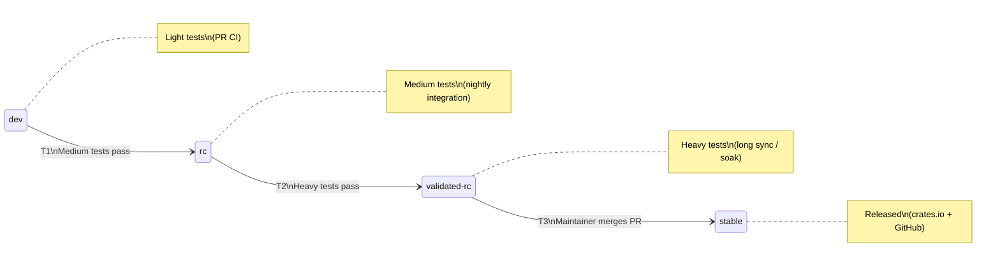
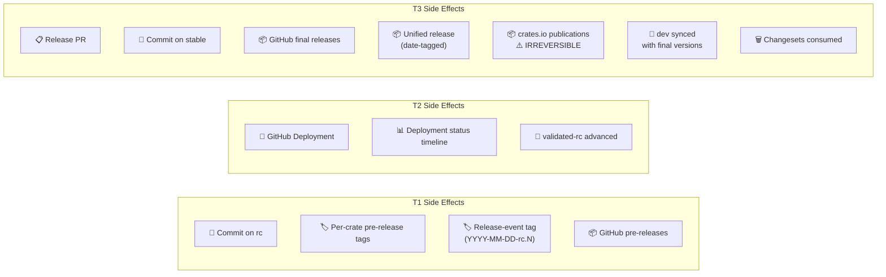

# Release Automation

## How a change gets released

Each step answers a question:

| Step | Question answered |
| ---- | ----------------- |
| PR with changeset | "What changed and how significant is it?" |
| Dev merge | "Does it pass basic quality checks?" |
| Nightly tests | "Does it work with the full integration suite?" |
| RC cut | "What would the next release look like?" |
| Heavy deployment | "Does it survive real-world conditions?" |
| Release blessing | "Are we confident enough to ship this?" |
| Stable release | "It's out. What versions, where to find them." |

## Technical Detail

The release system is a state machine operating on git branches. A
commit progresses through states (branches) as it passes successive
quality gates. Each transition is implemented as a GitHub Actions
workflow with explicit triggers, guards, actions, and side effects.

## State Machine

A state is a branch. A commit's "state" is the highest branch it has
reached. Transitions are workflows triggered by events.

## Transition Detail

```mermaid
flowchart LR
    subgraph T1 ["T1: dev → rc"]
        direction TB
        nightly[/"⏰ Nightly schedule"/]
        medium["Medium tests\n(ci.yml)"]
        advance["advance-rc\n(xtask)"]
        knope_rc["knope prepare-release\n--prerelease-label rc"]
        push_rc["push rc +\nrelease-event tag"]
        knope_rel["knope release\n(pre-releases)"]
        dispatch["dispatch\nheavy-deploy"]

        nightly --> medium
        medium -->|pass| advance
        advance --> knope_rc
        knope_rc --> push_rc
        push_rc --> knope_rel
        knope_rel --> dispatch
    end

    subgraph T2 ["T2: rc → validated-rc"]
        direction TB
        deploy["heavy-deploy\n(GitHub Deployment)"]
        k8s[/"☸ k8s long sync\n(external)"/]
        callback["heavy-callback\n(deployment_status)"]
        promote["promote-rc\n(xtask)"]

        deploy --> k8s
        k8s -->|success| callback
        callback --> promote
    end

    subgraph T3 ["T3: validated-rc → stable"]
        direction TB
        pr["rc-pr\n(create/update PR)"]
        review[/"👤 Maintainer review"/]
        merge[/"👤 Merge PR"/]
        release["release-stable\n(xtask)"]
        final["knope release\n(final)"]
        publish["cargo publish\n(crates.io)"]
        unified["Unified GitHub\nrelease"]
        sync["stable → dev\nsync"]

        pr --> review
        review --> merge
        merge --> release
        release --> final
        final --> publish
        publish --> unified
        unified --> sync
    end

    dispatch --> deploy
    promote --> pr
```

## Side Effects per Transition

## States

| State | Meaning | Who advances it |
| ----- | ------- | --------------- |
| `dev` | Merged work. No quality guarantees beyond PR CI (light tests). | Developers (PR merge) |
| `rc` | Passed medium tests (integration suite). Release candidate. | Automation (nightly → medium tests → advance) |
| `validated-rc` | Passed heavy tests (long sync / soak). Eligible for release. | Automation (deployment success callback) |
| `stable` | Released. Final versions, published to crates.io and GitHub. | Maintainer (PR merge) |

## Transitions

Each transition is a workflow. The table below is the complete set.

### T1: dev → rc (Medium Tests Gate)

| | |
|-|-|
| **Workflow** | `rc-update.yml` |
| **Trigger** | `workflow_run`: CI - Nightly succeeds on `dev` |
| **Guard** | dev HEAD is not already an ancestor of rc |
| **Actions** | Merge dev into rc · knope prepare-release --prerelease-label rc · sync workspace deps · commit · tag (release-event) · push · knope release |
| **Side effects** | Per-crate GitHub pre-releases · Release-event tag (`YYYY-MM-DD-rc.N`) · RC commit on rc branch |
| **Skips when** | No changesets (rc advances but no version bump, no releases, no heavy deploy dispatched) |
| **On failure** | Merge conflict → workflow fails, manual resolution needed |
| **Dispatches** | `heavy-deploy.yml` (only if RC was cut) |

### T2: rc → validated-rc (Heavy Tests Gate)

This transition spans two workflows and an external system.

#### T2a: Deploy for heavy testing

| | |
|-|-|
| **Workflow** | `heavy-deploy.yml` |
| **Trigger** | `workflow_dispatch` from rc-update (or manual) |
| **Input** | `rc_sha`, `rc_tag` |
| **Guard** | None (always deploys) |
| **Actions** | Create GitHub Deployment in `heavy-test` environment · Set status to `in_progress` |
| **Side effects** | GitHub Deployment object with status timeline |
| **External** | k8s cluster picks up deployment, runs long sync, posts status updates, reports `success` or `failure` via Deployments API |

#### T2b: Promote on success

| | |
|-|-|
| **Workflow** | `heavy-callback.yml` |
| **Trigger** | `deployment_status` event: state=success, environment=heavy-test |
| **Guard** | Deployment state is `success` |
| **Actions** | Fast-forward `validated-rc` to the deployment's commit SHA |
| **Side effects** | `validated-rc` branch advanced |
| **Dispatches** | Triggers `rc-pr.yml` (via workflow_run) |

### T3: validated-rc → stable (Release Blessing)

This transition spans two workflows and a human decision.

#### T3a: Create/update release PR

| | |
|-|-|
| **Workflow** | `rc-pr.yml` |
| **Trigger** | `workflow_run`: Heavy Callback succeeds |
| **Guard** | `stable` branch exists |
| **Actions** | Generate PR body (version table + changelog) · Create or update PR (`validated-rc` → `stable`) · Post RC comment on existing PR |
| **Side effects** | GitHub Pull Request (created or updated) |

#### T3b: Finalize release

| | |
|-|-|
| **Workflow** | `release-stable.yml` |
| **Trigger** | `pull_request: closed` on `stable` branch, merged=true |
| **Guard** | PR was merged (not just closed) |
| **Actions** | knope prepare-release (final, consumes changesets) · sync workspace deps · commit · push stable · knope release (per-crate) · cargo publish (crates.io) · Create unified GitHub release · Merge stable into dev · push dev |
| **Side effects** | Per-crate GitHub releases (final) · Unified release (date-tagged) · crates.io publications · Changesets consumed · dev updated with final versions |

### T0: → dev (Feature Work)

Not part of the release automation, but included for completeness.

| | |
|-|-|
| **Workflow** | `changeset-check.yml` |
| **Trigger** | `pull_request` on `dev` |
| **Guard** | If `packages/` source changed, a `.changeset/*.md` must exist |
| **Side effects** | None (enforcement only) |
| **Bypass** | `skip-changeset` label |

## Scheduling

The medium test suite runs on a nightly schedule (`CI - Nightly`,
cron `30 3 * * *`). The nightly workflow is the **schedule**, not the
test. It invokes the medium test suite; the RC advancement triggers on
the test suite's success, not on the schedule directly.

If the schedule changes (e.g. every 2 days), the release flow is
unaffected — transitions trigger on test results, not on time.

## Release naming

Release events use date-based tags tied to the release period:

- **RC tags**: `YYYY-MM-DD-rc.N` (e.g. `2026-05-01-rc.0`)
- **Release tags**: `YYYY-MM-DD` (the release target date)
- **Per-crate tags**: `<crate>/v<version>` (e.g. `zainod/v0.2.1`)

The release target date is computed from a configured epoch and cadence
(currently weekly, anchored to a Friday). The RC number increments
within each period.

## Merge strategy

| Transition | Strategy | Reason |
| ---------- | -------- | ------ |
| feature → dev | Squash | Clean dev history, one commit per PR |
| dev → rc | Merge | Preserves ancestry for rc's knope commits to survive |
| rc → validated-rc | Fast-forward / reset | validated-rc is just a pointer to a specific rc commit |
| validated-rc → stable | Merge (regular) | Preserves ancestry for stable→dev sync |
| stable → dev | Merge | Brings final versions back to dev |

## Side effects inventory

Every side effect the automation produces, and which transition
creates it.

| Side effect | Transition | Reversible? |
| ----------- | ---------- | ----------- |
| Commit on `rc` (merge + knope) | T1 | Force-push to reset rc |
| Per-crate pre-releases (GitHub) | T1 | Delete release + tag |
| Release-event tag | T1 | Delete tag |
| GitHub Deployment object | T2a | Delete deployment |
| Deployment status updates | T2a (external) | Cannot undo |
| `validated-rc` branch advance | T2b | Force-push to reset |
| Release PR (created/updated) | T3a | Close PR |
| Commit on `stable` (knope final) | T3b | Revert commit |
| Per-crate final releases (GitHub) | T3b | Delete releases |
| Unified release (GitHub) | T3b | Delete release |
| crates.io publications | T3b | **Cannot undo** |
| Changesets consumed | T3b | Restore from git history |
| `dev` updated with final versions | T3b | Revert merge |

## xtask commands

Each transition delegates its logic to an xtask subcommand. All
support `--dry-run`.

| Command | Transition | Purpose |
| ------- | ---------- | ------- |
| `versioning changeset validate` | T0 | Validate changeset files |
| `versioning advance-rc --green-commit <sha>` | T1 | Merge dev→rc, knope, tag, release |
| `versioning deploy-heavy-test --rc-sha <sha> --rc-tag <tag>` | T2a | Create GitHub deployment |
| `versioning promote-rc --rc-sha <sha>` | T2b | Advance validated-rc |
| `versioning release-pr-body` | T3a | Generate PR body (stdout) |
| `versioning release-pr-title` | T3a | Generate PR title (stdout) |
| `versioning release-rc-comment --short-sha <sha>` | T3a | Generate PR comment (stdout) |
| `versioning release-stable` | T3b | Full stable release |

## Failure modes

| Failure | Impact | Recovery |
| ------- | ------ | -------- |
| Merge conflict (dev→rc) | RC not advanced | Manual: resolve conflict on rc, push |
| knope prepare-release fails | RC partially advanced (merged but no version bump) | Reset rc to previous commit |
| knope release fails (tag exists) | Versions bumped but no GitHub releases | Delete conflicting releases/tags, re-run |
| Heavy test fails | validated-rc not advanced | Next RC will be tested |
| cargo publish fails | Some crates published, others not | Re-run `cargo publish` for failed crates |
| stable→dev merge conflict | Stable released but dev not synced | Manual: resolve conflict on dev |
